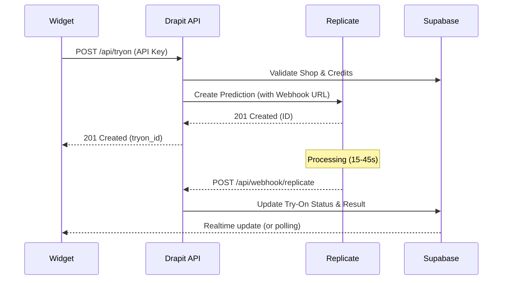

# Drapit — Webhook Setup

Drapit uses [Replicate](https://replicate.com) webhooks to asynchronously receive results from the AI virtual try-on model (`viktorfa/idm-vton`). When a prediction completes or fails, Replicate sends a POST request to your webhook endpoint.

**Webhook endpoint:** `https://app.drapit.io/api/webhook/replicate`

---

## 1. Local Testing (Ngrok)

To test webhooks locally, you need a public URL that forwards to your local server.

1. Install [ngrok](https://ngrok.com/)
2. Start your local server: `npm run dev` (usually on port 3000)
3. In a new terminal, run: `ngrok http 3000`
4. Copy the "Forwarding" URL (e.g., `https://a1b2-c3d4.ngrok-free.app`)
5. Your local webhook URL is now: `https://a1b2-c3d4.ngrok-free.app/api/webhook/replicate`

## 2. Configuration

### Environment Variables

Add these to your `.env.local`:

```bash
NEXT_PUBLIC_APP_URL=https://app.drapit.io
REPLICATE_WEBHOOK_SECRET=your_secret_here (optional, for validation)
```

### Prediction Request

When creating a prediction, Drapit automatically includes the webhook URL:

```typescript
// Example from app/api/tryon/route.ts
prediction = await createTryOnPrediction(
  model_image,
  garment_image,
  'https://app.drapit.io/api/webhook/replicate',  // ← webhook URL
  shopId
);
```

---

## 3. Data Flow



---

## 4. Troubleshooting

### Webhook not firing
1. Check the Replicate dashboard for prediction status.
2. Verify `NEXT_PUBLIC_APP_URL` is correct.
3. Check `app/api/webhook/replicate/route.ts` logs.

### Testing with CURL
You can simulate a webhook call:

```bash
curl -X POST https://app.drapit.io/api/webhook/replicate \
  -H "Content-Type: application/json" \
  -H "X-Drapit-Key: your-test-api-key" \
  -d '{
    "id": "pred_123",
    "status": "succeeded",
    "output": ["https://replicate.delivery/pbxt/result.png"]
  }'
```
